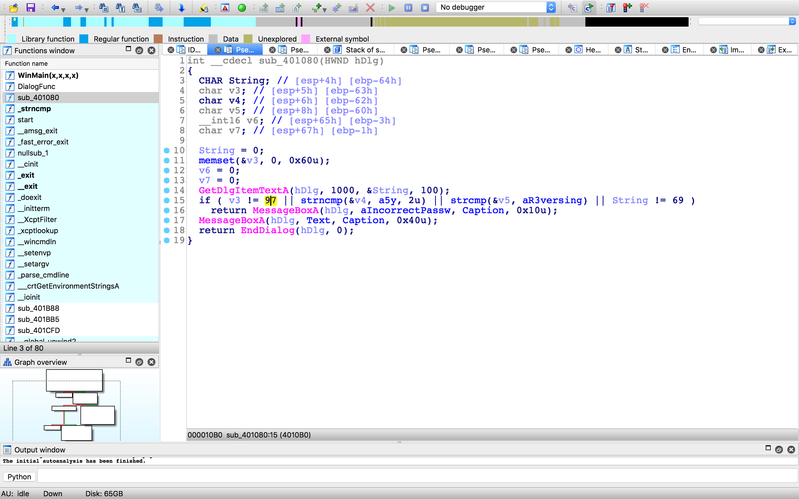

# Easy_CrackMe

```
 ⚙ junhoyeo@Macbookui-MacBook-Pro  ~/Downloads  file Easy_CrackMe.exe
Easy_CrackMe.exe: PE32 executable (GUI) Intel 80386, for MS Windows
```



```
int __cdecl sub_401080(HWND hDlg)
{
  CHAR String; // [esp+4h] [ebp-64h]
  char v3; // [esp+5h] [ebp-63h]
  char v4; // [esp+6h] [ebp-62h]
  char v5; // [esp+8h] [ebp-60h]
  __int16 v6; // [esp+65h] [ebp-3h]
  char v7; // [esp+67h] [ebp-1h]

  String = 0;
  memset(&v3, 0, 0x60u);
  v6 = 0;
  v7 = 0;
  GetDlgItemTextA(hDlg, 1000, &String, 100);
  if ( v3 != 97 || strncmp(&v4, a5y, 2u) || strcmp(&v5, aR3versing) || String != 69 )
    return MessageBoxA(hDlg, aIncorrectPassw, Caption, 0x10u);
  MessageBoxA(hDlg, Text, Caption, 0x40u);
  return EndDialog(hDlg, 0);
}
```

1. 먼저 `v3 != 97`인지 확인

`v3`은 String[1] (esp 위치 통해 확인)

97과 비교하므로

```
>>> chr(97)
'a'
```

String = `?a`

2. `strncmp(&v4, a5y, 2u)`

`v4`은 String[2]

`strncmp()`의 형태는 `char * strncmp( const char *s1, const char *s2, size_t n);`

s1부터 n개의 문자를 s2와 비교해서 맞으면 0을 반환

v4에서부터 2개의 문자를 `5y`와 비교하므로

String = `?a5y`

3. `strcmp(&v5, aR3versing)`

역시 이를 통해서 String 뒷부분이 `R3versing`임을 알 수 있음

String = `?a5yR3versing`

4. 마지막으로 `String != 69`인지 확인

```
>>> chr(69)
'E'
```

String = `E` + `a` + `5y` + `R3versing` = `Ea5yR3versing`

Flag : `Ea5yR3versing`
